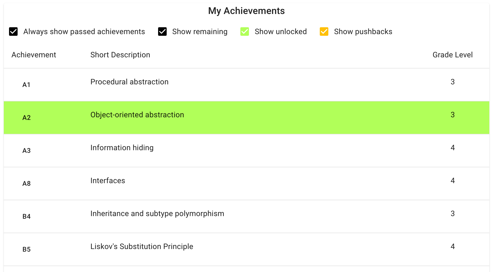
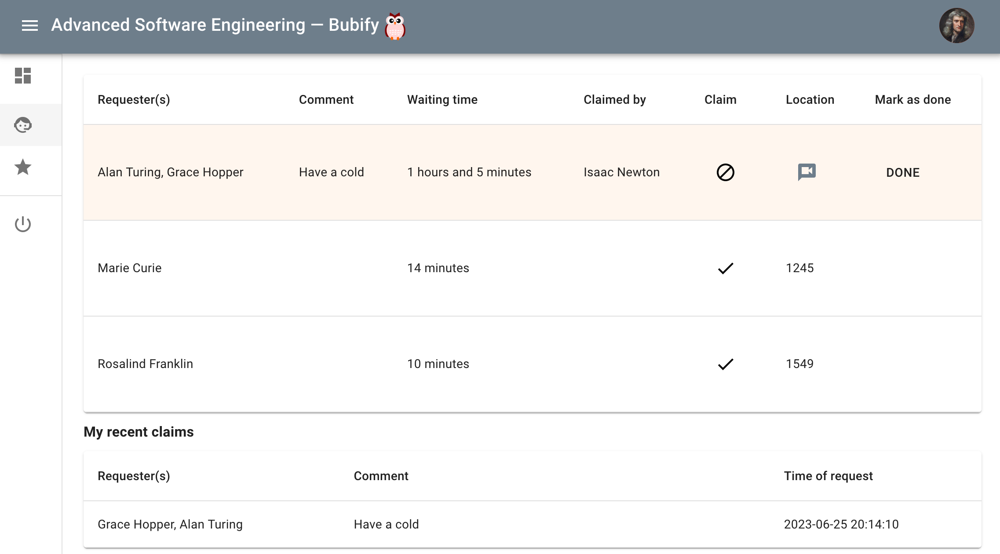

# Features

Bubify uses a responsive design and is friendly for both desktops and mobile.

## Student

### Burndown Chart and Progress Tracking
{ align=left }
For courses with a lot of achievements/tasks, Bubify provides the students a tool to visualize their progress and at what pace they need to keep in order to earn a grade given a certain date. The grade and date is configurable by the student.

### List of Passed Achievements
{ align=left }
Bubify also provide students a filterable list to browse what achievements/tasks remains. Courses may also optionally use "pushbacks" for achievements/tasks, where the student get blocked from undertaking a demonstration for that achievements/tasks for 24 hours.

### Queue: Demonstrate
{ align=left }
Students can search with autocomplete what achievements/tasks they wish to demonstrate and may add other students to their request.

### Queue: Help
{ align=left }
There is also a help list. Courses may allow for a hybrid mode where students are allowed to use Zoom if they cannot attend. It is also possible to only allow physical requests or only requests with Zoom.

## Teacher

### Queue: Demonstrate
{ align=left }
First time a student demonstrates you verify that the profile picture is acceptable. A student may only reupload a new profile picture if a teacher revokes it. This ensures that it is not possible to let someone else demonstrate on your behalf.

### Queue: Help
{ align=left }
Teachers will have a clear view of who has waited for help the longest, where they are located and if they have some special request.

### Statistics: Quality of Service

{ align=left }

Head teachers may find it useful to have live statistics at their disposal to understand if the course is running smoothly.